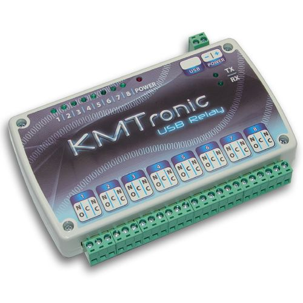
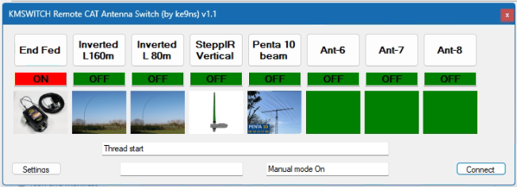
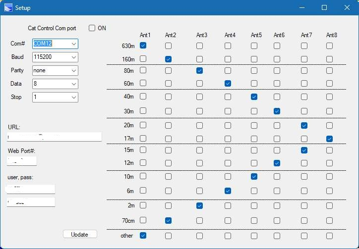

<!-- This makes the image show up beautifully on GitHub -->

   
   
    
    
  <b>KMSWITCH: Used with an Antenna switch for Amateur Radio</b>
   

# KMSWITCH
For those using a KMTronics 8-channel USB Relay controller, to control up to 8 antennas for Amateur Radio.
The relay outputs from the KMTronic controller can be connected to a simple antenna switch.

This program will Connect your KMTronics 8-channel USB Relay controller via HTTP Internet connection
provided you have a URL address, Port, User name, and Password
Setup allows you to use a COM port to send/receive CAT commands to change antennas as your radio changes frequencies
For SDR type radios, you need a Virtual COM port pair connected to your radio.
This program will automatically send a AI command to your radio. 
This will force your radio to send a FA (Frequency of VFOA) every time you move frequency
This will update the KMSWITCH automatically to the antenna via a Band-Frequency matrix (in setup of KMSWITCH)

You will need to create a folder at the root of your C: drive called KMSWITCH
This folder must contain the CATStructs.xml file
You can also add your own JPG photos of your antennas.
The photo for Ant1 needs to be called 1.jpg (and so on for up to 8 antennas)
a ke9ns8.dat will be created after the first launch of the program, it will contain all the URL, COM port, and Matrix parameters